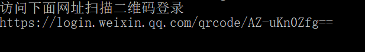
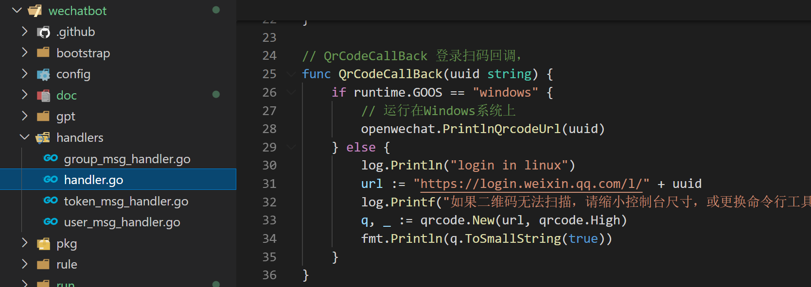

# 文档

## 说明

### 登录二维码

每次启动项目后,会在 `handler.go` 下的 `QrCodeCallBack(uuid string)` 函数中调用 openchat项目下 `bot.go` 中的方法 `PrintlnQrcodeUrl()` 根据登录扫码回调，返回的 `uuid`生成一个二维码网址

具体的项目代码如下:





二维码生成的规则: 
```
微信二维码官网地址[https://login.weixin.qq.com/qrcode/] + uuid
```

具体的项目代码如下:

